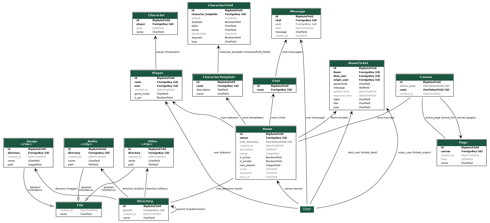

# Proyecto de Desarrollo Web: RolGM

## Descripción
Este es un proyecto desarrollado por [Iván De La Poza](https://github.com/IvanDLPG) para el proyecto de final de curso. 
El proyecto consiste en un entorno que facilite los Juegos de Rol mediante el uso de herramientas creadas especificamente 
para cubrir las necesidades de los jugadores.

## Tutores del proyecto
- [Fernández Hernández, Gonzalo](https://github.com/GonxFH) [Tutor General]
- [Gallardo Crespillo, Patricia A.](https://github.com/Irtnia) [Tutora Individual]

## Requisitos
- Es necesario tener instalado [Docker](https://www.docker.com/)
- Es recomendable tener Make instalado. Si no lo tienes, puedes copiar los comandos del Makefile y ejecutarlos manualmente
- Es necesario contar con almenos 3.5 GB de espacio de almacenamiento

## Instalación
1. Descarga el proyecto en [zip](https://github.com/IvanDLPG/rolgm-project/archive/refs/heads/main.zip) o clónalo con Git.
2. Copia y modifica el fichero ".env.example" con el nombre ".env" (Está preparado para funcionar pero se recomienda personalizarlo).
3. Usa el comando "make init" del Makefile del proyecto. Esto instalará y configurará todo lo necesario.

## Uso
1. Ejecuta el comando "make up" o "make start" para levantar los contenedores mostrando o no el prompt.
2. Accede a la aplicación por defecto desde http://172.18.0.2:8000 (Servidor) http://172.18.0.3:5173 (Cliente).

## Licencia
Este proyecto está bajo la Licencia [CC BY-NC-SA 4.0](https://creativecommons.org/licenses/by-nc-sa/4.0/deed.es). Consulta la web de [CreativeCommons](https://creativecommons.org/licenses/by-sa/3.0/es/) para más información.

## Esquema de BBDD

